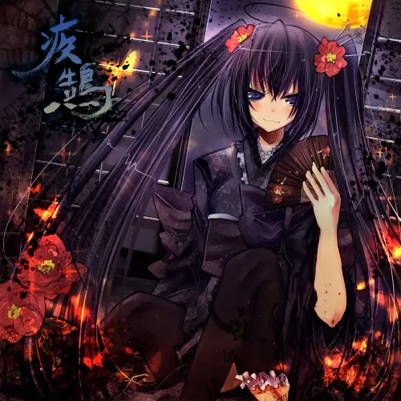

# 疾鵠

作曲担当のにュウと作詞担当の和鳳(なげは)による、コラボ「な~にP」名義の初CD。メインボーカルは初音ミク。壮大なシンフォニックサウンドと圧倒的疾走感はまるで北欧メタル。

## 収録曲

1. [娯疾駆](../lyrics/娯疾駆)
1. 貴方は愛に謳う
1. tear candy, milk drop
1. [迷響詩酔](../lyrics/迷響詩酔)
1. 愛を詠いますか？
1. 百音色

## 配信中のサブスクリプションサービス

- [Apple Music](https://music.apple.com/jp/album/shikkoku-ep/479478433)
- [Spotify](https://open.spotify.com/intl-ja/album/4HjLAwENaSYalU7yY7ttMG)
